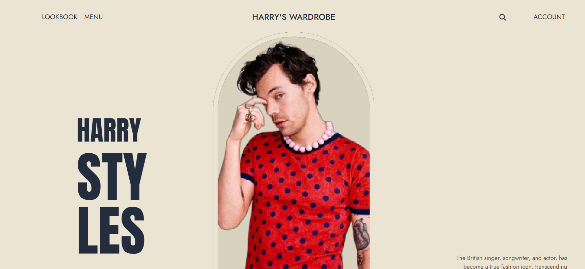
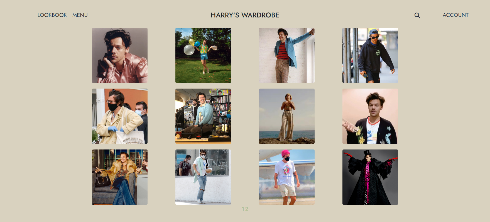
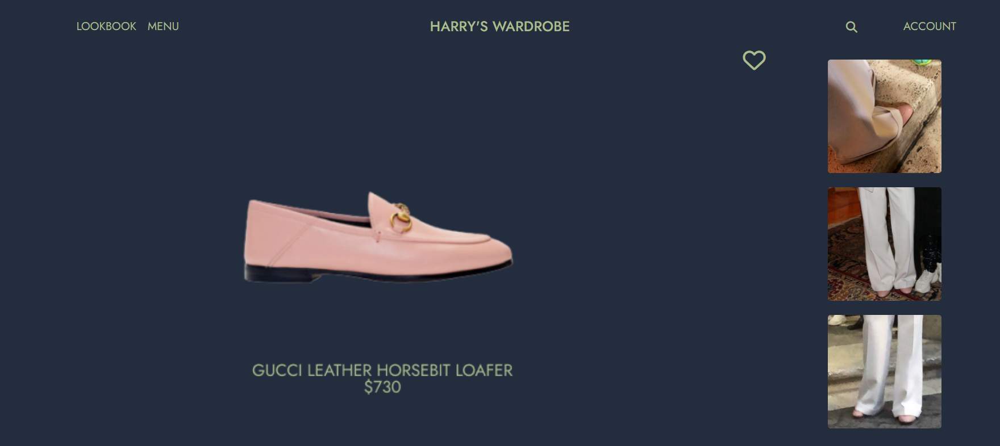
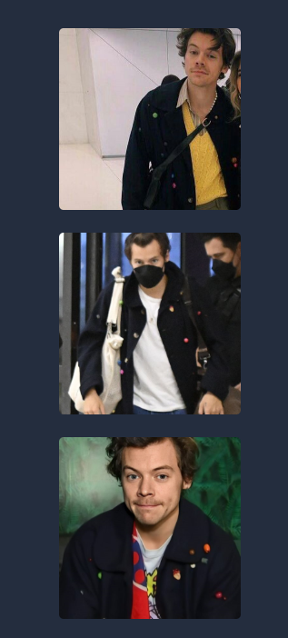
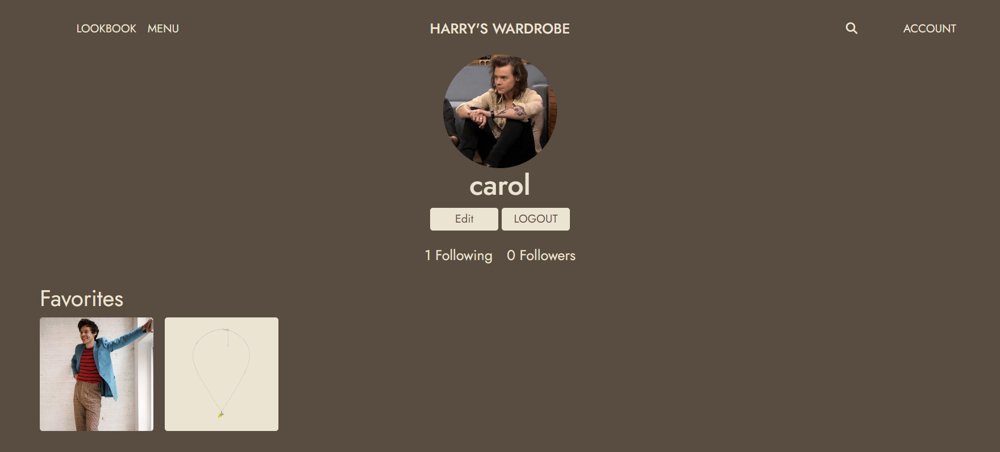
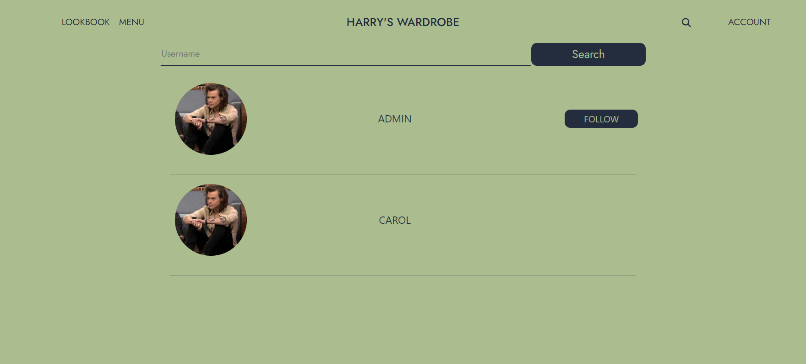
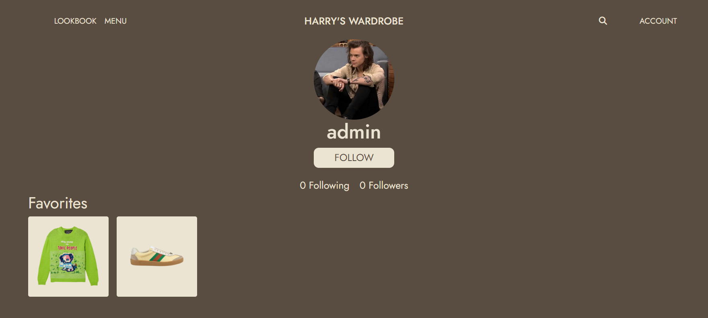

<b>HARRY'S CLOSET</b>

## Team:

<table align="center">
    <tr>
        <td align="center">
             
            
            <b>Carolina Costa 
        </td>
    </tr>
</table>

## Tecnologies and tools used:

Structuring and developing the Web page:

Frameworks:

Internal structure of the project:

Development of the visual identity and communication:

## About the project:

Welcome to Harry Styles' Style Hub, your ultimate destination for all things related to Harry Styles' iconic fashion choices. Our mission is to celebrate and showcase the diverse and captivating wardrobe of one of the world's most influential fashion icons.

<b>Landing Page</b>:

<b>Explore His Wardrobe</b>: Dive into a curated collection of Harry Styles' outfits, categorized by tops, bottoms, outerwear, shoes, and accessories.

<b>Price Information</b>: Discover the cost of each clothing item featured in Harry's looks, making it easier to replicate his style.

<b>Versatile Occasions</b>: See how Harry Styles effortlessly rocks each outfit in various occasions and settings.

 

<b>Personal Favorites</b>: Create your profile, save your favorite outfits, and tailor your style inspiration to your liking.

<b>Search for friends</b>: Search for your friends username and follow them or see their favorite outfits!

Join us on this fashionable journey as we unravel the style secrets of Harry Styles, and let his iconic fashion choices inspire your own wardrobe.

## Demo Link:

You can explore a live demo of Harry's Closet by visiting [here](https://harrys-wardrobe.netlify.app/).

## Known Limitations:

Mobile responsiveness is a work in progress.

## Roadmap:

We have exciting plans for the future of Harry's Closet, including:

<b>Expanding the database of outfits and their associated prices.</b> 
<b>Enhancing mobile responsiveness for a seamless experience on all devices.</b>
